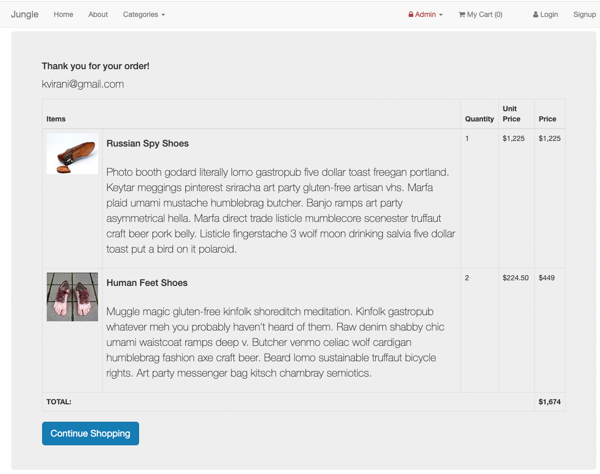
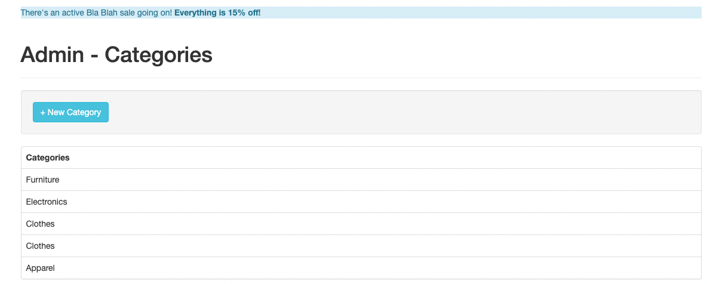

# Jungle

A mini e-commerce application built with Rails 4.2 for purposes of teaching Rails by example.

## User Section

### Landing Page

Landing page, with an overview of all available products.

### Product Details

Displays details for a specific product.

### Categories Menu

List all available categories.

### Product by Category

List a subset of products based on a category selection.

### Checkout Page

Displays the content of the cart to proceed with order.

### Order Summary

Displays order summary, once order has been finalized.

### About Us

Details about the e-commerce.

## Admin Section

### Admin Dashboard

Overview of categories and products available.

### Products Administration

Manage the available products.

### New Product

Product creation page.

### New Product Validation

### Categories Administration

Manage the available categories.

### New Category

Category creation page.

### Sales Administration

Manage the available sales. When a sale is active, a banner will appear on the site pages.

### New Sale

Sale creation page.

ß

## Dependencies

- Rails 4.2 [Rails Guide](http://guides.rubyonrails.org/v4.2/)
- PostgreSQL 9.x
- Stripe

## Tests

- Capybara
- RSpec

## Getting Started

1. Run `bundle install` to install dependencies
2. Create `config/database.yml` by copying `config/database.example.yml`
3. Create `config/secrets.yml` by copying `config/secrets.example.yml`
4. Run `bin/rake db:reset` to create, load and seed db
5. Create .env file based on .env.example
6. Sign up for a Stripe account
7. Put Stripe (test) keys into appropriate .env vars
8. Run `bin/rails s -b 0.0.0.0` to start the server

## Stripe Testing

Use Credit Card # 4111 1111 1111 1111 for testing success scenarios.

More information in their docs: <https://stripe.com/docs/testing#cards>
